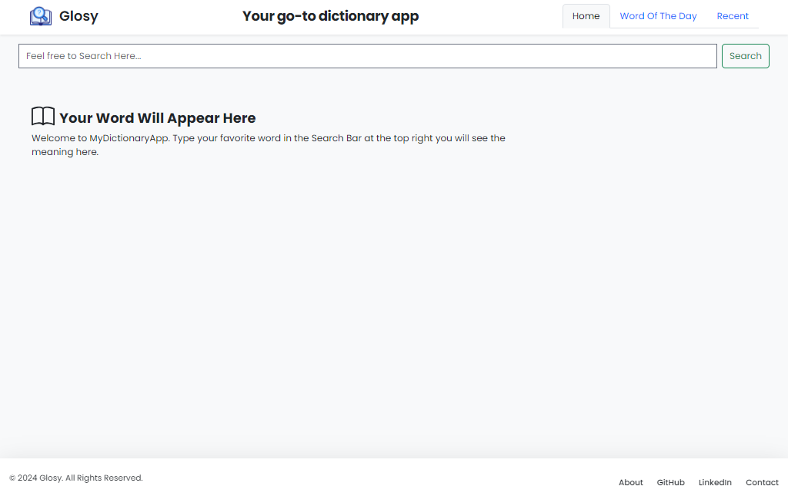
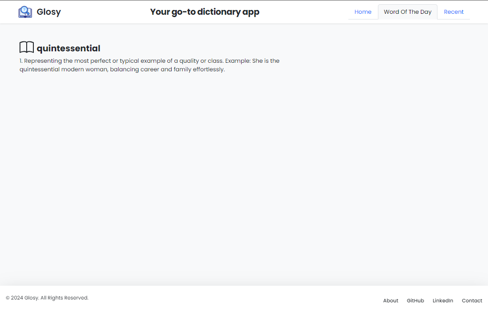
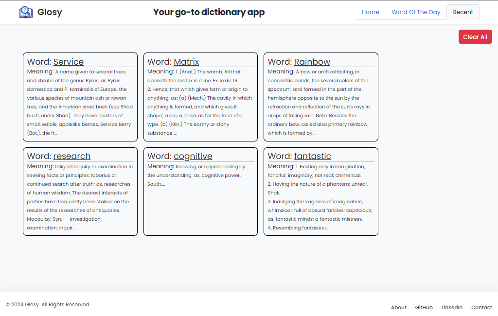

# Glosy
Glosy is a dictionary app designed to provide users with concise definitions of words in various forms. It offers the ability to search for word meanings quickly, displaying the standard definitions.
The app is tailored to be user-friendly, allowing for quick navigation and easy access to information, making it a handy tool for users looking to expand their vocabulary or get precise definitions on the go.

# Features

<h1>Word Search:</h1> 

Users can search for words to get their definitions. When a word is entered in the search bar, the app fetches the definition from an API and displays it on the screen.

<h1>Recent Words:</h1>

 The app keeps a history of recently searched words. These are stored in the browser's local storage and displayed under a "Recent" tab, allowing users to quickly access previously searched words and their definitions.

<h1>Word of the Day:</h1> 

Each day, the app displays a "Word of the Day" along with its definition, selected randomly from a predefined list of words. This feature is aimed at enhancing vocabulary by introducing a new word daily.

<h1>Persistent Storage:</h1> 

The app uses local storage to maintain the list of recent searches and the current "Word of the Day", ensuring that this data persists even after the page is refreshed.

<h1>Responsive UI:</h1> 

The interface is designed to be responsive, ensuring a smooth user experience across different device sizes, from desktops to mobile devices.

<h1>Year Display:</h1> 

The current year is dynamically displayed in the footer of the app, making it look up-to-date.

# Images

